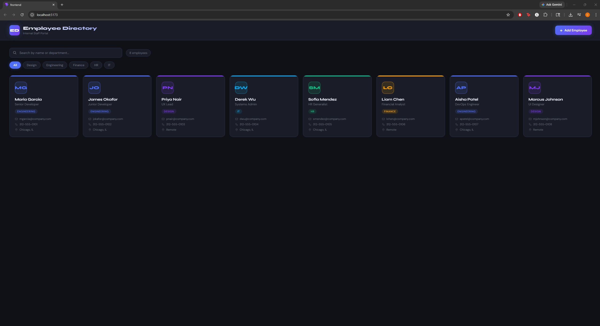
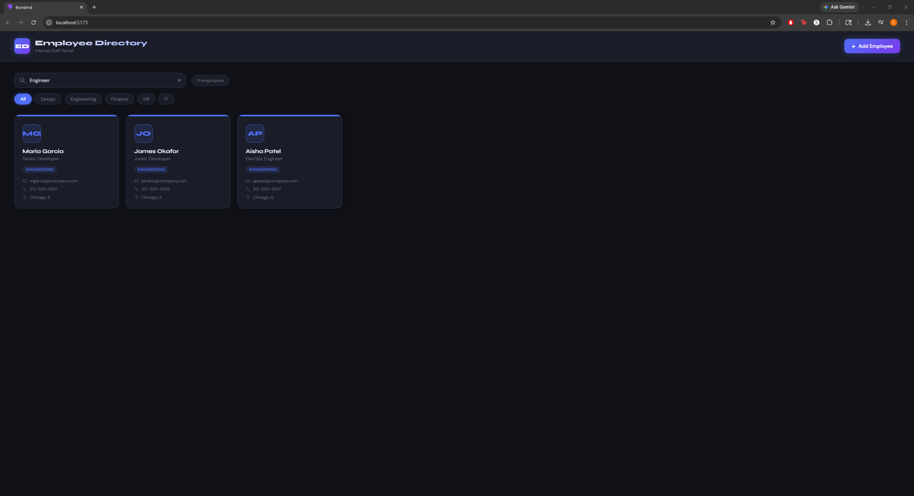
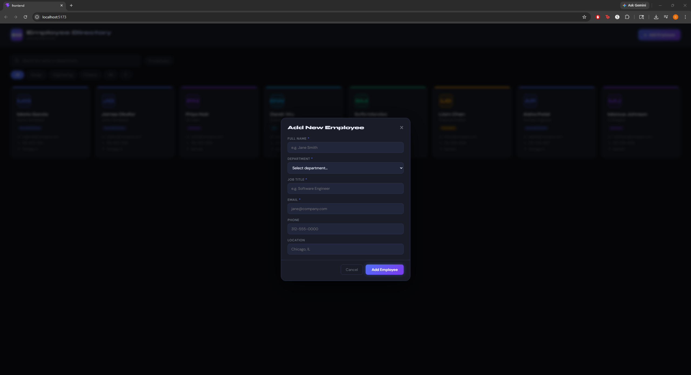

# Employee Directory

A full-stack Employee Directory web application built with React and Python/Flask. Designed to mimic the core functionality of a Power Apps Canvas app — live search, department filtering, and CRUD operations — using a modern code-based stack.

---

## Screenshots

### Main Directory View


### Department Filter


### Add Employee Modal


---

## Tech Stack

**Frontend**
- React 18 (Vite)
- Axios
- CSS Variables / Custom styling

**Backend**
- Python 3 / Flask
- Flask-CORS
- SQLite (via Python's built-in `sqlite3`)

---

## Features

-  Employee card grid with name, title, department, email, phone, and location
-  Live search by name or department
-  One-click department filter pills
-  Add new employees via a validated modal form
-  Persistent data via SQLite database
-  RESTful API backend with Flask

---

## Project Structure
employee-directory/
├── backend/
│   ├── app.py           # Flask REST API routes
│   ├── database.py      # SQLite setup and seed data
│   ├── employees.db     # Auto-generated SQLite database
│   └── requirements.txt
└── frontend/
├── src/
│   ├── App.jsx
│   ├── App.css
│   ├── main.jsx
│   ├── index.css
│   └── components/
│       ├── EmployeeGrid.jsx
│       ├── SearchBar.jsx
│       └── AddEmployeeModal.jsx
├── package.json
└── vite.config.js

---

## Getting Started

### Prerequisites
- Python 3.x
- Node.js and npm

### 1. Clone the repository
```bash
git clone https://github.com/cnart003/employee-directory.git
cd employee-directory
```

### 2. Start the Backend
```bash
cd backend
python -m venv venv
venv\Scripts\activate        # Windows
pip install -r requirements.txt
python app.py
```
Backend runs on `http://localhost:5000`

### 3. Start the Frontend
Open a second terminal:
```bash
cd frontend
npm install
npm run dev
```
Frontend runs on `http://localhost:5173`

---

## API Endpoints

| Method | Endpoint | Description |
|--------|----------|-------------|
| GET | `/api/employees` | Get all employees (supports `?search=` and `?department=`) |
| POST | `/api/employees` | Add a new employee |
| GET | `/api/departments` | Get list of all departments |

---

## Adding Screenshots

1. Take screenshots of the running app
2. Create a `screenshots/` folder in the project root
3. Save images as `main-view.png`, `department-filter.png`, and `add-employee.png`
4. Push to GitHub — they will automatically appear in this README

---

## Author

**Caleb** · [github.com/cnart003](https://github.com/cnart003)
